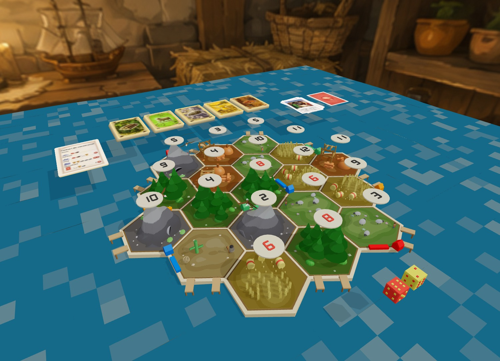
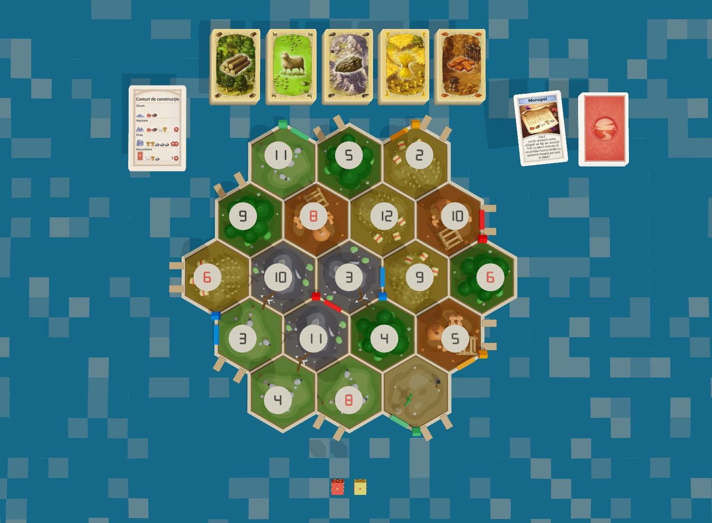
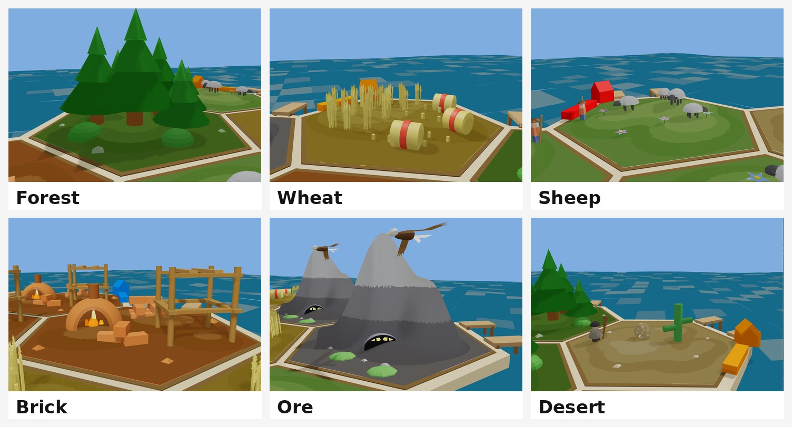
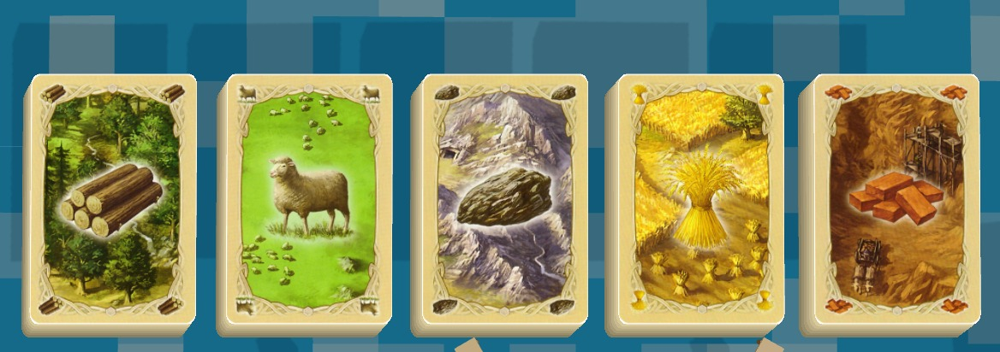
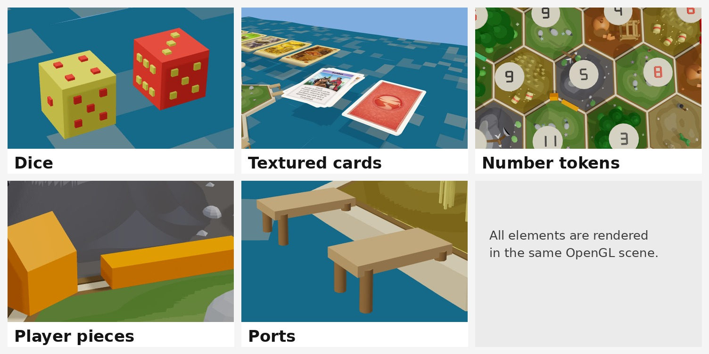
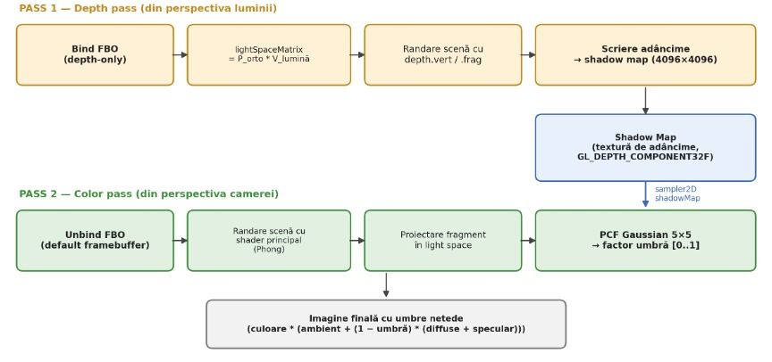
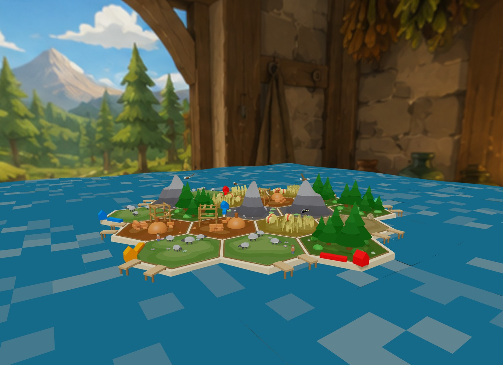

<div align="center">

# CatanMap

### Interactive 3D board-game scene built with C++ and modern OpenGL

A stylized board inspired by *Catan*, featuring procedural resource biomes, interactive game elements and a complete real-time rendering pipeline.

<br>



<br>


</div>

---

## About the Project

**CatanMap** is an educational computer-graphics project that recreates a stylized 3D board-game environment inspired by *Catan*.

The scene contains a complete 19-tile board, procedural resource biomes, number tokens, player pieces, ports, dice, textured cards, development cards, water and an environmental skybox. Most objects are assembled from reusable geometric primitives instead of imported 3D models.

The project demonstrates a complete modern OpenGL workflow, including reusable geometry, GLSL shaders, transformations, interactive camera controls, lighting, transparency, shadow mapping and several advanced OpenGL state-management techniques.

> This is a non-commercial educational project inspired by a board-game concept. It is not an official Catan product.

---

## Main Features

### Procedural board scene

* 19-tile hexagonal board layout
* Forest, wheat, sheep, brick, ore and desert biomes
* Modular objects built from reusable geometric primitives
* Randomized tile distribution and number tokens
* Player pieces, ports, dice and decorative board elements
* Water surface and cubemap skybox environment

### Rendering pipeline

* Modern OpenGL pipeline with VAO and VBO buffers
* Model, view and projection transformations
* GLSL vertex and fragment shaders
* Phong-style lighting with hemispheric ambient light
* Quantized diffuse lighting for a stylized low-poly appearance
* Shadow mapping with depth framebuffer rendering
* Gaussian 5 × 5 PCF filtering for softer shadow edges
* Alpha blending and distance-based fading
* Face culling and stencil testing
* 4 × MSAA anti-aliasing
* Reinhard tone mapping, saturation adjustment and gamma correction
* Procedural rounded card corners using a signed-distance function

### Interactive elements

* Camera rotation, zoom and panning
* Randomized tile distribution and player pieces
* Animated dice rolling
* Development-card flipping
* Configurable card and token positioning while zooming

---

## Screenshots

### Complete Board Layout

<div align="center">
  
</div>

### Procedural Resource Biomes

Each resource tile is assembled from reusable geometric primitives. The scene includes forest, wheat, sheep, brick, ore and desert tiles.

<div align="center">
  
</div>

### Textured Resource Cards

BMP textures are loaded into OpenGL and applied to the resource cards and development cards.

<div align="center">
  
</div>

### Game Elements

The board also includes dice, number tokens, pieces and ports.

<div align="center">
  
</div>

### Shadow Mapping Flow

<div align="center">
  
</div>

### Skybox Environment

<div align="center">
  
</div>

---

## Technical Overview

| Area                  | Technologies and concepts                                                  |
| --------------------- | -------------------------------------------------------------------------- |
| Programming language  | C++17                                                                      |
| Graphics API          | Modern OpenGL                                                              |
| Shaders               | GLSL vertex and fragment shaders                                           |
| Geometry              | Reusable procedural primitives and hexagonal-tile generation               |
| Lighting              | Phong-style lighting, hemispheric ambient light and quantized diffuse light |
| Shadows               | Depth framebuffer, shadow map and Gaussian 5 × 5 PCF filtering             |
| Transparency          | Alpha blending and distance-based fading                                   |
| Image assets          | BMP textures and cubemap skybox textures                                   |
| Rendering techniques  | Face culling, stencil testing, MSAA and tone mapping                        |
| Build system          | CMake                                                                      |

---

## Interactive Controls

| Input           | Action                                                                          |
| --------------- | ------------------------------------------------------------------------------- |
| `A` / `D`       | Rotate the camera horizontally                                                  |
| `W` / `S`       | Rotate the camera vertically                                                    |
| `Q` / `E`       | Zoom in or out                                                                  |
| Left mouse drag | Pan the camera target across the board                                          |
| `R`             | Randomize the tile distribution, number tokens and player pieces                |
| `Space`         | Roll the dice                                                                   |
| `T`             | Flip the next development card; reset the deck after all cards have been shown |
| `F`             | Pin or unpin the cards and number tokens while changing the camera distance     |
| `Esc`           | Close the application                                                           |

---

## Project Structure

```text
catan-opengl/
├── README.md
├── screenshots/
│   └── readme/
│       ├── 01-hero-full-scene.jpg
│       ├── 02-board-top-view.jpg
│       ├── 03-resource-cards.jpg
│       ├── 04-procedural-biomes.jpg
│       ├── 05-shadow-map-flow.jpg
│       ├── 06-game-elements.jpg
│       └── 07-skybox-environment.jpg
└── CatanMap/
    ├── main.cpp                 # Application entry point and render loop
    ├── Board.* / Tile.*         # Board generation and tile data
    ├── ForestTile.*             # Procedural forest biome
    ├── WheatTile.*              # Procedural wheat biome
    ├── SheepTile.*              # Procedural pasture biome
    ├── BrickTile.*              # Procedural brick biome
    ├── OreTile.*                # Procedural ore biome
    ├── DesertTile.*             # Procedural desert biome
    ├── Card.* / Bitmap.*        # BMP loading and card rendering
    ├── Dice.* / Pieces.*        # Interactive game elements
    ├── Ports.* / NumberToken.*  # Board details
    ├── Water.* / Skybox.*       # Environment rendering
    ├── ShadowMap.*              # Depth framebuffer and shadow mapping
    ├── shaders/                 # GLSL vertex and fragment shaders
    ├── cards/                   # BMP card textures
    ├── skybox/                  # Cubemap BMP textures
    └── external/                # Included third-party headers and sources
```

The CMake configuration copies the `shaders/`, `cards/` and `skybox/` asset folders next to the executable after a successful build.

---

## Run the Project Locally

### Requirements

* A C++17-compatible compiler
* CMake 3.16 or newer
* An OpenGL-compatible graphics driver

### Configure and build the application

From the project folder:

```bash
cd CatanMap
cmake -S . -B build
cmake --build build --config Release
```

Run the generated executable from the build output directory. Its exact path depends on the operating system and the selected CMake generator.

---

## Project Note

Most visual objects are generated procedurally from simple primitives. This keeps the scene modular and makes it possible to extend individual biomes without depending on imported 3D models.

The board can be regenerated by shuffling tile types and number tokens while preserving the original 19-tile structure.

---

## Future Improvements

* Import support for complex `.obj` models
* Tile selection and resource highlighting
* Movable player pieces
* Additional animations for water, cards and natural elements
* More detailed materials and normal maps
* Rendering optimizations for larger scenes

---

## What I Learned

This project helped me deepen my understanding of:

* building a complete 3D scene with modern OpenGL;
* structuring a modular C++ graphics project;
* generating reusable procedural geometry;
* working with model, view and projection transformations;
* writing and organizing GLSL shaders;
* implementing lighting and stylized rendering techniques;
* creating a shadow-mapping pipeline with filtered shadow edges;
* managing transparency, face culling and stencil testing;
* loading textures and rendering cubemap skyboxes;
* connecting rendering features with interactive controls;
* organizing a visual computer-graphics project for a public portfolio.

---

## Author

**Daria-Adelinne-Elena Cristea**
